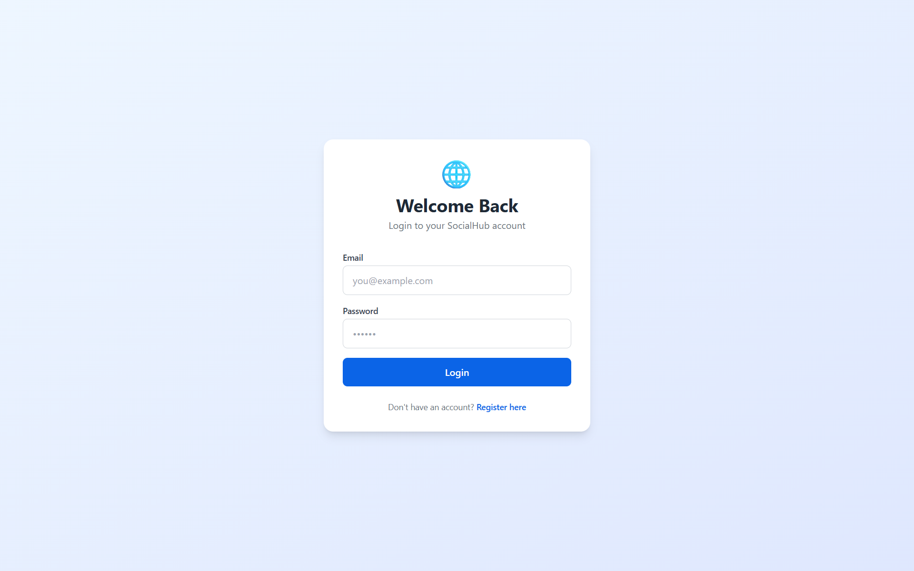
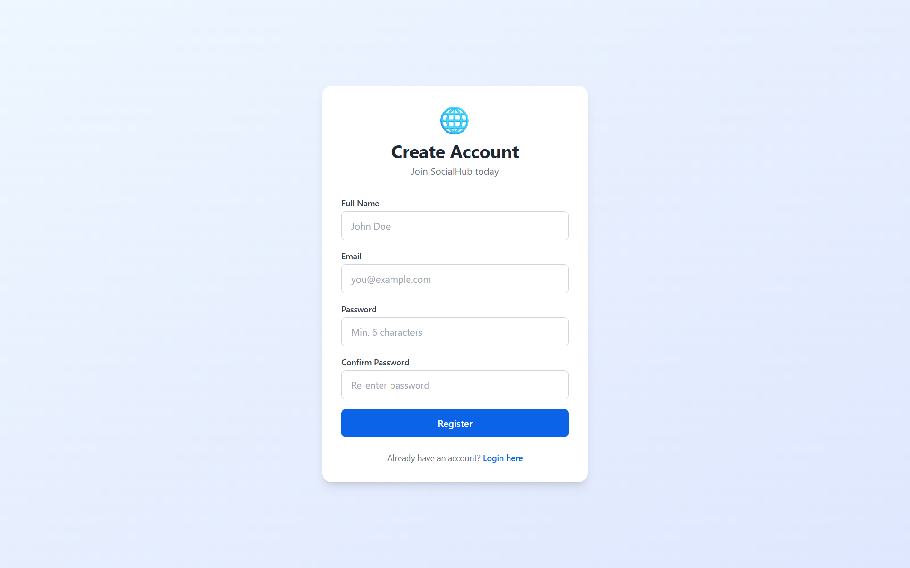
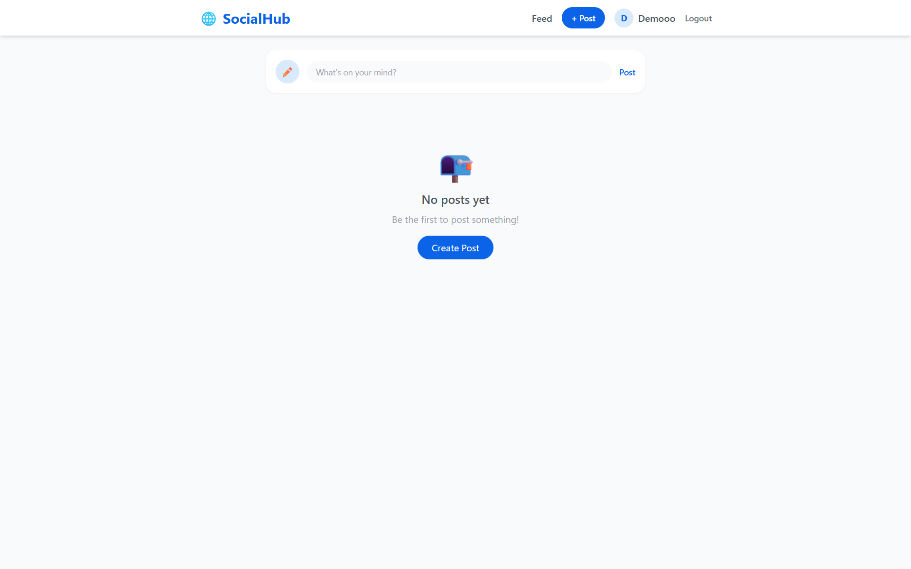
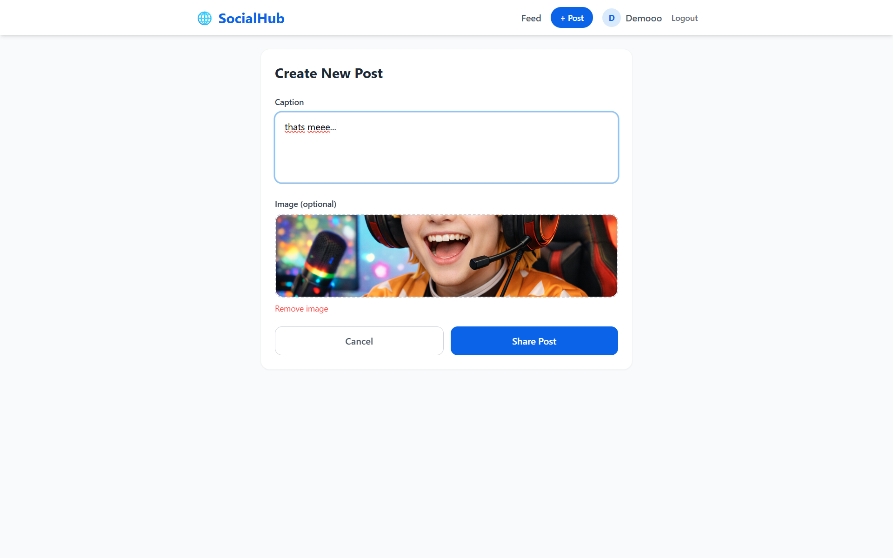
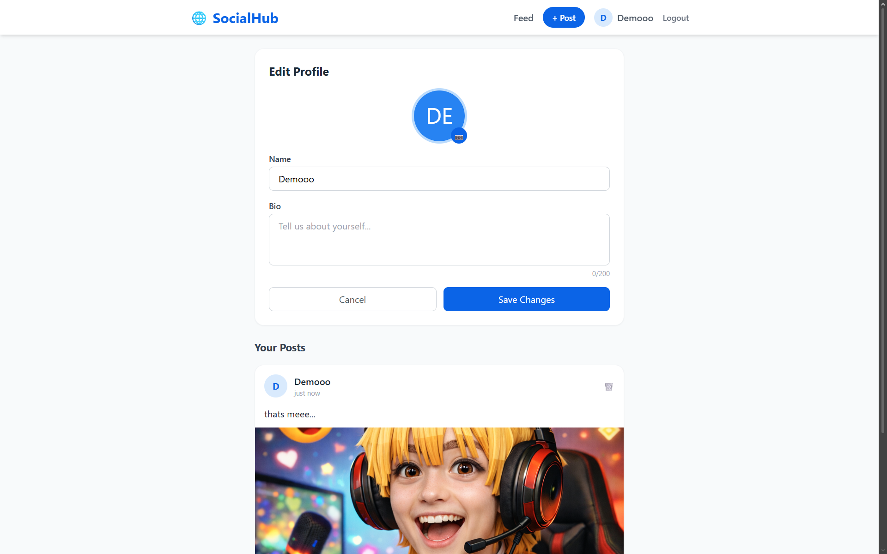

# 🌐 PRODIGY_FS_05 — Social Media Platform

A Full Stack Social Media Web Application built as part of the **Prodigy Infotech Full Stack Development Internship**.

---

## 📋 Project Overview

SocialHub is a beginner-friendly social media platform where users can:
- Create an account and login securely
- Create posts with captions and images
- Like and comment on posts from other users
- View and edit their profile
- Browse other users' profiles

---

## ✨ Features

- ✅ User Registration & Login (JWT Authentication)
- ✅ Create, View, Delete Posts
- ✅ Image Upload (Cloudinary)
- ✅ Like / Unlike Posts
- ✅ Comment on Posts
- ✅ User Profile with Edit (name, bio, profile image)
- ✅ View other users' profiles and posts
- ✅ Fully Responsive UI (Tailwind CSS)
- ✅ Protected Routes

---

## 🛠️ Tech Stack

| Layer      | Technology           |
|------------|----------------------|
| Frontend   | React + Vite         |
| Styling    | Tailwind CSS         |
| Backend    | Node.js + Express.js |
| Database   | MongoDB Atlas        |
| Auth       | JWT + bcryptjs       |
| Images     | Cloudinary           |

---

## 📁 Folder Structure

```
PRODIGY_FS_05/
├── client/                   # React Frontend
│   ├── src/
│   │   ├── pages/            # All page components
│   │   ├── components/       # Reusable components
│   │   ├── context/          # Auth context (global state)
│   │   ├── utils/            # Axios API utility
│   │   ├── App.jsx
│   │   └── main.jsx
│   ├── index.html
│   └── package.json
├── server/                   # Node.js Backend
│   ├── models/               # MongoDB schemas
│   ├── routes/               # API route handlers
│   ├── middleware/           # JWT auth middleware
│   ├── config/               # Cloudinary config
│   ├── index.js              # Server entry point
│   └── package.json
├── screenshots/              # Project screenshots
└── README.md
```

---

## ⚙️ Installation & Setup

### Step 1 — Clone / Extract the Project

```bash
# If from GitHub:
git clone https://github.com/SiddharthBhat120/PRODIGY_FS_05.git
cd PRODIGY_FS_05
```

---

### Step 2 — Setup Backend (Server)

```bash
cd server
npm install
```

Create a `.env` file inside the `server/` folder:

```env
PORT=5000
MONGODB_URI=your_mongodb_atlas_connection_string
JWT_SECRET=your_secret_key_here
CLIENT_URL=http://localhost:5173
CLOUDINARY_NAME=your_cloudinary_name
CLOUDINARY_KEY=your_cloudinary_api_key
CLOUDINARY_SECRET=your_cloudinary_api_secret
```

Run the backend:

```bash
npm run dev
```

Backend runs at: `http://localhost:5000`

---

### Step 3 — Setup Frontend (Client)

Open a new terminal:

```bash
cd client
npm install
npm run dev
```

Frontend runs at: `http://localhost:5173`

---

## 🔗 API Endpoints

### Auth
| Method | Endpoint              | Description       |
|--------|-----------------------|-------------------|
| POST   | /api/auth/register    | Register user     |
| POST   | /api/auth/login       | Login user        |

### Posts
| Method | Endpoint                     | Description         |
|--------|------------------------------|---------------------|
| GET    | /api/posts                   | Get all posts       |
| POST   | /api/posts                   | Create post         |
| PUT    | /api/posts/like/:id          | Like/Unlike post    |
| POST   | /api/posts/comment/:id       | Add comment         |
| DELETE | /api/posts/:id               | Delete post         |

### Users
| Method | Endpoint                | Description              |
|--------|-------------------------|--------------------------|
| GET    | /api/users/profile      | Get own profile          |
| PUT    | /api/users/profile      | Update own profile       |
| GET    | /api/users/:id          | Get any user's profile   |
| GET    | /api/users/:id/posts    | Get posts by user        |

---

## 📸 Screenshots









---

## 🚀 Deployment

### Frontend → Vercel
1. Push `client/` to GitHub
2. Go to [vercel.com](https://vercel.com) → New Project
3. Import your repo
4. Set root to `client/`
5. Deploy!

### Backend → Render
1. Push `server/` to GitHub
2. Go to [render.com](https://render.com) → New Web Service
3. Connect your repo
4. Set root to `server/`
5. Set Build Command: `npm install`
6. Set Start Command: `node index.js`
7. Add all `.env` variables in Render's Environment tab
8. Deploy!

### Database → MongoDB Atlas
1. Go to [mongodb.com/cloud/atlas](https://www.mongodb.com/cloud/atlas)
2. Create free cluster
3. Get connection string
4. Whitelist all IPs: `0.0.0.0/0`
5. Paste URI in your `.env`

---

## 📤 GitHub Upload Guide

```bash
# Step 1 — Initialize git in root folder
git init

# Step 2 — Add all files
git add .

# Step 3 — Commit
git commit -m "Task 5 completed - Social Media Platform PRODIGY_FS_05"

# Step 4 — Connect to GitHub
git remote add origin https://github.com/SiddharthBhat120/PRODIGY_FS_05.git

# Step 5 — Push
git branch -M main
git push -u origin main
```

For future updates:
```bash
git add .
git commit -m "Updated project"
git push
```

---

## 💼 LinkedIn Post

> 🚀 Excited to share my **Task 5** completion as part of my Full Stack Development Internship at **Prodigy Infotech**!
>
> Built a complete **Social Media Platform** — SocialHub — from scratch using:
> 🔹 React + Vite (Frontend)
> 🔹 Node.js + Express.js (Backend)
> 🔹 MongoDB Atlas (Database)
> 🔹 JWT Authentication
> 🔹 Cloudinary for Image Uploads
>
> Features include: User Registration/Login, Create Posts, Like & Comment, Profile Management, and Image Uploads.
>
> A great learning experience building a full-stack social platform! 💪
>
> **#ProdigyInfotech #Internship #FullStack #ReactJS #NodeJS #MongoDB #WebDevelopment**

---

## 👨‍💻 Author

**Siddharth Bhat** — MCA Student | Full Stack Development Intern @ Prodigy Infotech

GitHub: [@SiddharthBhat120](https://github.com/SiddharthBhat120)
